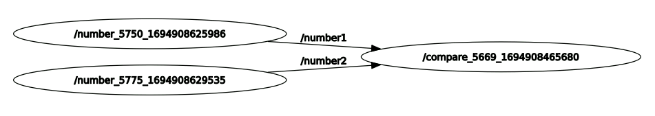
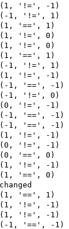

# rospy_example
rospy.Subscriber()가 multi-thread로 동시 수행되므로 공유자원의 접근에 문제가 발생할 수 있음을 보이는 예제입니다.

# build
```
$ catkin_make
```

# run example
각각 터미널에서 다음을 순서대로 실행합니다.
```
$ roscore
$ rosrun rospy_example number.py number1
$ rosrun rospy_example number.py number2
$ rosrun rospy_example compare.py
```
다음과 같이 3개의 ROS node로 구성된 시스템입니다.<p>
<br>
compare node에서 number1, number2를 받아서 같은가를 비교합니다.<p>
출력은 다음과 같습니다.<p>
<p>
조건문에서 비교할 때는 같지만 print() 문으로 출력할 때는 다른 값이 출력되는 경우가 발생함을 알 수 있습니다.
